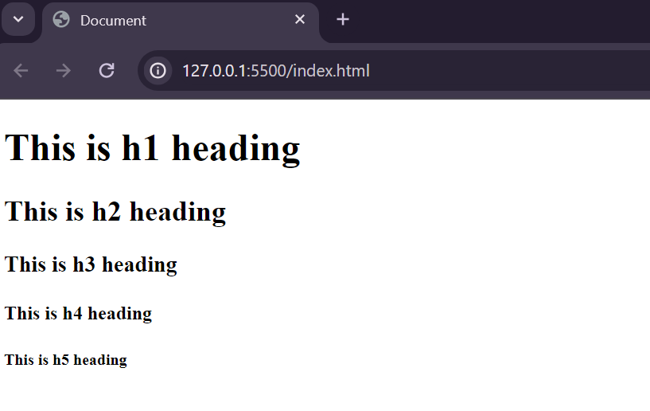

# HTML stands for 
- H: Hyper
- T: Text
- M: Mark-up
- L: Language

You could say that HTML add structure for a website, a foundation to saupport content for a website.

# Basic index.html starting point

```
<!DOCTYPE html>
<html lang="en">
<head>
    <meta charset="UTF-8">
    <meta name="viewport" content="width=device-width, initial-scale=1.0">
    <title>Document</title>
</head>
<body>
    
</body>
</html>
```

**useful tags**
```
<br>    <!--breaks the line-->
<hr>    <!--adds a horizontal line-->
```

**Heading**
-----------------------------------------------------------------------------------------------------------------------------


```
<body>
    <h1>This is h1 heading</h1>
    <h2>This is h2 heading</h2>
    <h3>This is h3 heading</h3>
    <h4>This is h4 heading</h4>
    <h5>This is h5 heading</h5>
</body>
```

**Paragraph**
-----------------------------------------------------------------------------------------------------------------------------
```
<p>Hello world</p>    <!--This will hold the paragraph and no matter
                          what changes you make to it it will retain its         
                           paragraph form-->

<pre>                   <!--This way the text between will contain the line break-->

Hello

World

</pre>
```
